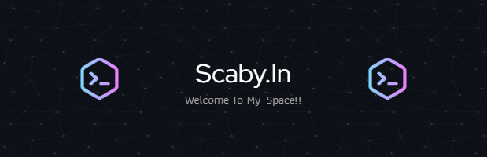

  

- 👨‍💻 I’m currently learning **MERN STACK**
- 🔭 My projects are available at <a href="https://linktr.ee/sundeshbatheja"> **sundesh batheja's projects**</a> 

- 📫 How to reach me **sundesh.batheja.75@gmail.com**

- ⚡ Fun fact <b>**I think iam a Good Singer 😶‍🌫️**</b>

<h3 align="left">Connect with me:</h3>

<h3 align="left">Languages and Tools:</h3>

         

    
  
   

      

&nbsp;

       

